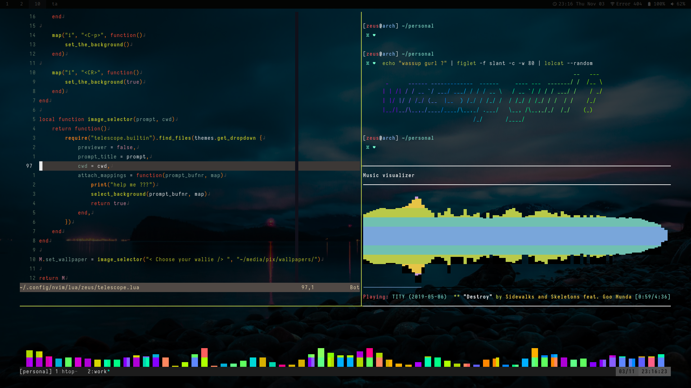
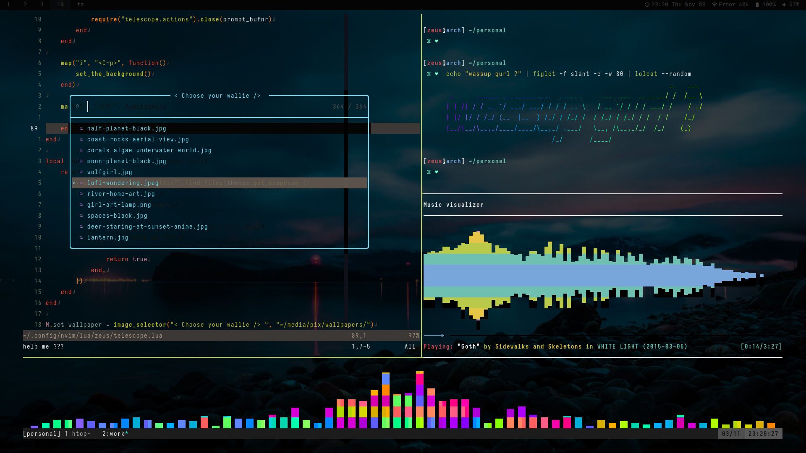
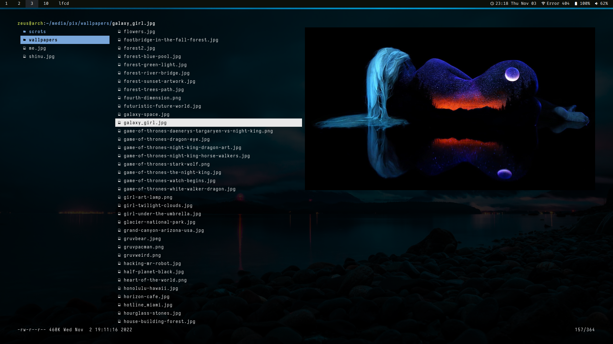
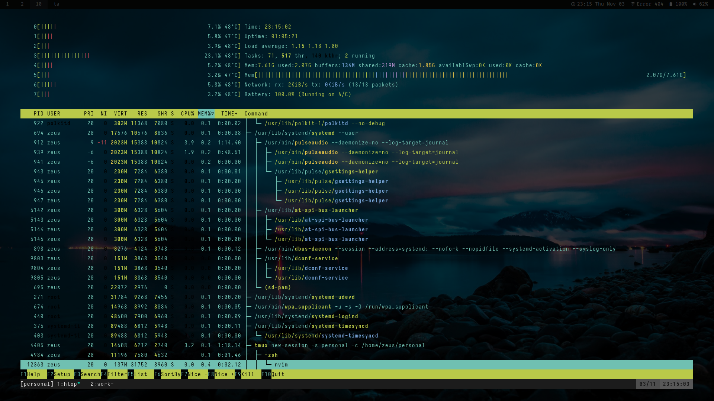

# DOTS

Welcome to my dotfiles and configurations for a basic arch linux setup

> Note:
in development

## Scrots






## Install

1. Clone this repository and change directory into it:

    ```sh
    git clone https://github.com/7ze/dots.git ~/
    cd dots
    ```

2. Make changes to the install script as necessary, and run it:

    ```sh
    ./install.sh
    ```

## License

Licensed under [GNU GPL-3.0](/LICENSE)
